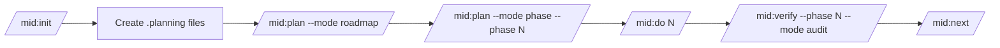
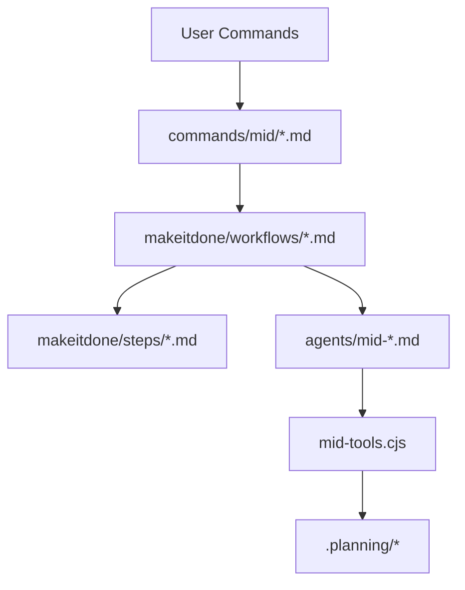

# make-it-done

Token-optimized orchestration framework for Claude Code projects.

[](https://nodejs.org/)
[](https://www.npmjs.com/package/make-it-done)
[](./package.json)


`make-it-done` helps you run projects in structured phases, break work into wave-sized chunks, and keep orchestration token usage low with TOON-based payloads.

## Table of Contents

- [Why makeitdone](#why-makeitdone)
- [Core Workflow](#core-workflow)
- [Architecture](#architecture)
- [Install](#install)
- [Quick Start](#quick-start)
- [Commands](#commands)
- [Project Structure](#project-structure)
- [Token Optimization](#token-optimization)
- [Configuration](#configuration)
- [Troubleshooting](#troubleshooting)
- [Development](#development)
- [Roadmap](#roadmap)
- [License](#license)

## Why makeitdone

- Phase-based planning: keep scope explicit and milestone-driven.
- Wave execution: group independent tasks for efficient parallel-style progress.
- Lean orchestration: 5 focused agents and selective step injection.
- Built-in quality gates: verify progress before phase transitions.
- TOON-native payloads: lower token overhead versus verbose JSON flows.

## Core Workflow



## Architecture



**Execution model**
- Commands are thin stubs that delegate to workflows.
- Workflows orchestrate state, model routing, and agent handoffs.
- `mid-tools.cjs` handles TOON conversion and state/config/roadmap utilities.
- `.planning/STATE.md` is the single execution truth for phase/wave progress.

## Install

### Quick install (npx)

No global install needed:

```bash
# Claude Code (global)
npx make-it-done --claude --global

# Claude Code (project-local)
npx make-it-done --claude --local

# OpenCode (global)
npx make-it-done --opencode --global

# OpenCode (project-local)
npx make-it-done --opencode --local
```

### From npm

```bash
npm install -g make-it-done
# or
bun add -g make-it-done

# Then run installer
makeitdone --claude --global       # install for Claude Code (global)
makeitdone --claude --local        # install for Claude Code (project-local)
makeitdone --opencode --global     # install for OpenCode (global)
makeitdone --opencode --local      # install for OpenCode (project-local)
```

### From source (development)

```bash
git clone https://github.com/itzmail/make-it-done.git
cd make-it-done
npm install
node bin/install.js --claude --global
```

### Update or uninstall

```bash
makeitdone --update --global
makeitdone --uninstall --global
```

## Quick Start

1) Initialize project context:

```bash
/mid:init
```

2) Generate roadmap:

```bash
/mid:plan --mode roadmap
```

3) Plan first phase:

```bash
/mid:plan --mode phase --phase 1
```

4) Execute phase:

```bash
/mid:do 1
```

5) Verify and move next:

```bash
/mid:verify --phase 1 --mode audit
/mid:next
```

6) Check progress anytime:

```bash
/mid:status
```

## Commands

| Command | Purpose |
|---|---|
| `/mid:init` | Initialize a new makeitdone project |
| `/mid:plan` | Create/update roadmap and phase plans |
| `/mid:do` | Execute phase plans using wave workflow |
| `/mid:verify` | Run quality checks (integration/security/ui/audit) |
| `/mid:next` | Advance to next phase after successful verification |
| `/mid:status` | Show current project status |
| `/mid:report` | Generate project report |
| `/mid:debug` | Diagnose execution blockers/failures |
| `/mid:backlog` | Manage project backlog items |
| `/mid:quick` | Ad-hoc execution without full phase ceremony |
| `/mid:help` | Command reference |

## Project Structure

After `/mid:init`, your project gets a planning workspace:

```text
project-root/
├── .planning/
│   ├── PROJECT.md
│   ├── REQUIREMENTS.md
│   ├── ROADMAP.md
│   ├── STATE.md
│   ├── config.json
│   └── phases/
│       ├── 01/
│       ├── 02/
│       └── 03/
└── (your application code)
```

Core templates shipped with framework:
- `makeitdone/templates/project.md`
- `makeitdone/templates/requirements.md`
- `makeitdone/templates/roadmap.md`
- `makeitdone/templates/state.md`
- `makeitdone/templates/plan.md`
- `makeitdone/templates/summary.md`

## Token Optimization

### 1) TOON-native utilities

```bash
node ~/.claude/makeitdone/bin/mid-tools.cjs init execute 1
node ~/.claude/makeitdone/bin/mid-tools.cjs state get
```

### 2) Selective step injection

Workflows include only the fragments they need instead of loading every step file.

### 3) Context-aware degradation

| Context window | Tier | Behavior |
|---|---|---|
| `< 300k` | POOR | read-only fallback, limited actions |
| `300k-500k` | DEGRADING | favor small reads + lightweight models |
| `500k-1M` | GOOD | standard operation |
| `> 1M` | PEAK | full capability |

### 4) Lean agent set

5 consolidated agents replace larger multi-agent layouts from older versions.

## Configuration

Project-level config lives at `.planning/config.json`:

```json
{
  "project_name": "My Project",
  "description": "Brief description",
  "model_profile": "balanced",
  "context_window": 200000,
  "team_size": 1,
  "created": "2026-04-05"
}
```

Model profiles:
- `budget`: prioritize lower token cost
- `balanced`: quality/cost default
- `quality`: prefer stronger generation models

## Troubleshooting

- **Missing `.planning` files**: run `/mid:init` first, then `/mid:plan --mode roadmap`.
- **Phase not found**: confirm phase directory exists under `.planning/phases/`.
- **State drift**: use `mid-tools state get` to inspect current phase/wave truth.
- **Low context behavior**: reduce large reads and run focused commands (`status`, then `plan/do`).
- **Node runtime issues**: use Node.js 18+.

## Development

Build bundled utility:

```bash
node build.js
```

Watch mode:

```bash
node build.js --watch
```

Package metadata and release notes:
- `package.json`
- `CHANGELOG.md`

## Roadmap

Planned next improvements:
- CI integrations and workflow automation hooks
- richer notifications
- broader compatibility beyond current runtime assumptions
- expanded test coverage and benchmarks

## License

MIT

---

Built for structured execution with token discipline as a first-class constraint.
